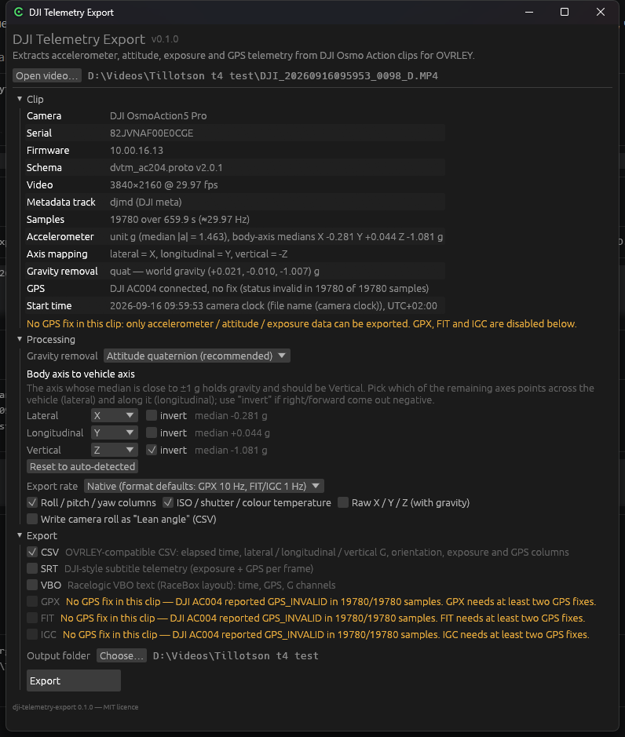

# DJI Telemetry Export

[English version](README.md)

Извлекает телеметрию, которую камеры DJI Osmo Action записывают внутрь MP4-файлов, и сохраняет её в
**CSV, SRT, VBO, GPX, FIT или IGC** — готовую к импорту в [OVRLEY](https://github.com/sstoychev/OVRLEY)
(или в любую другую программу, читающую эти форматы).

> **Визуализация данных:** используйте [OVRLEY](https://www.ovrley.cc/) — бесплатное офлайн-приложение,
> которое накладывает телеметрию на видео в виде настраиваемых оверлеев (G-метр, скорость, карта,
> приборы). Экспортируйте файл этой программой, импортируйте его в OVRLEY вместе с видео и отрендерите
> оверлей. См. раздел [Импорт в OVRLEY](#импорт-в-ovrley) ниже.

Один самодостаточный исполняемый файл для Windows и macOS с простым графическим интерфейсом и полноценной
командной строкой.



## Зачем

DJI Osmo Action 4/5/6 пишут в MP4 дорожку `djmd` с метаданными: по одному protobuf-сообщению на кадр
видео с показаниями акселерометра, кватернионом ориентации, ISO / выдержкой / цветовой температурой и —
при подключённом GPS-пульте **AC004** — координатами, высотой, скоростью и GPS-временем.

OVRLEY умеет читать эту дорожку, но оставляет только сэмплы с валидным GPS-фиксом. Если у пульта не было
фикса (или он не был подключён), ролик отображается как «no telemetry», хотя данные акселерометра в нём
есть. Эта программа читает ту же дорожку напрямую, убирает гравитацию, переводит оси камеры в оси
транспортного средства и экспортирует то, что реально содержится в клипе.

## Скачать

Свежая сборка — на странице **Releases**:

| Платформа | Файл | Примечания |
|---|---|---|
| Windows 10/11 x64 | `dji-telemetry-export-<версия>-windows-x64.zip` | Распакуйте и запустите `dji-telemetry-export.exe`. SmartScreen может один раз спросить («Подробнее» → «Выполнить в любом случае»). |
| macOS 11+ (Apple Silicon + Intel) | `dji-telemetry-export-<версия>-macos-universal.dmg` | Приложение не нотаризовано: при первом запуске — правой кнопкой → **Открыть**, либо `xattr -cr "/Applications/DJI Telemetry Export.app"`. |

Без установщика, без рантаймов, без доступа в сеть.

## Работа в графическом интерфейсе

1. **Open video…** (или перетащите MP4 в окно / на исполняемый файл).
2. Проверьте панель **Clip**: камера, частота сэмплов, единицы акселерометра, состояние GPS, время начала.
3. **Processing**
   * *Gravity removal* — по умолчанию гравитация убирается по кватерниону ориентации (сохраняется
     длительное боковое ускорение в повороте); также доступны ФВЧ по скользящему среднему и режим
     «оставить гравитацию».
   * *Body axis to vehicle axis* — ось, медиана которой близка к ±1 g, содержит гравитацию и заранее
     выбрана как **Vertical**. Ось X камеры — это её оптическая ось, поэтому при обычном креплении
     объективом вперёд она заранее выбрана как **Longitudinal** (вдоль машины), а оставшаяся — как
     **Lateral** (поперёк). Поменяйте их местами, если камера смотрит вбок, и поставьте *invert*,
     если знаки получаются наоборот. Знаки выбраны так, как принято показывать на G-метре — куда
     бросает водителя: торможение даёт отрицательное продольное, **левый** поворот — **положительное**
     боковое. Для Osmo Action 5 Pro (X вперёд, Y вправо) автоопределение даёт
     `lateral = -Y, longitudinal = X`.
   * *G-force gauge* — два переключателя, *Mirror left / right* и *Swap braking / acceleration*,
     которые разворачивают канал относительно описанного выше дефолта (то же, что галочки *invert*
     у осей, но в терминах прибора).
   * *Level to the vehicle* — включено по умолчанию. Камера почти никогда не стоит строго
     горизонтально; при наклоне на 30° вниз половина каждой кочки попадала бы в продольный канал,
     а торможение показывалось бы лишь на 87 %. Показания поворачиваются покадрово (по кватерниону
     ориентации) так, чтобы гравитация лежала точно на вертикальной оси, и только потом делятся на
     каналы. Найденный наклон показан рядом с галочкой и в `--info`.
   * *Export rate* — родная частота (строка на кадр) либо 10 / 5 / 1 Гц.
4. **Export** — отметьте форматы и нажмите *Export*. Файлы пишутся рядом с видео как
   `<имя клипа>.<расширение>`, если не выбрана другая папка.

Форматы, которым нужна GPS-позиция, отключены с пояснением, когда в клипе нет фикса.

### Импорт в OVRLEY

Импортируйте видео, затем импортируйте экспортированный файл как активность. Строка 0 любого экспорта —
это кадр 0 видео, поэтому смещение синхронизации равно **0**. Для G-метра используйте CSV: OVRLEY
напрямую читает колонки `Lateral acceleration (g)`, `Longitudinal acceleration (g)`,
`Vertical acceleration (g)` и `Combined acceleration (g)` (а также широту / долготу / высоту /
скорость / курс, когда есть GPS). Датчик OVRLEY рисует положительное боковое ускорение вправо, а
положительное продольное — *вниз* (экранные координаты), поэтому со знаками по умолчанию точка
уходит вверх при торможении и вправо в левом повороте — туда, куда бросает водителя.

## Командная строка

```
dji-telemetry-export <VIDEO> [ОПЦИИ]

  -f, --formats <LIST>     csv,srt,vbo,gpx,fit,igc или "all"       [по умолчанию: csv]
  -o, --out <DIR>          папка вывода                            [по умолчанию: рядом с видео]
      --gravity <MODE>     quat | highpass | none                  [по умолчанию: quat]
      --highpass-window <S>  окно для --gravity highpass           [по умолчанию: 1.0]
      --axes <SPEC>        auto | xyz | lateral=x,longitudinal=y,vertical=z   [по умолчанию: auto]
      --invert <LIST>      lateral,longitudinal,vertical
      --no-level           оставить собственный тангаж / крен камеры, не выравнивать по машине
      --rate <RATE>        native | <Гц>                           [по умолчанию: native]
      --unit <g|ms2|mg>    принудительно задать единицы акселерометра
      --raw-axes           добавить сырые колонки X/Y/Z (CSV)
      --no-orientation     убрать колонки roll/pitch/yaw (CSV)
      --no-exposure        убрать колонки ISO/выдержка/цветовая температура (CSV)
      --lean-angle         записать крен камеры как "Lean angle" (CSV)
      --info [--json]      вывести сводку по клипу и доступность форматов и выйти
      --inspect [N]        вывести дерево protobuf первых N сэмплов метаданных
```

Примеры:

```sh
dji-telemetry-export DJI_20260916095953_0098_D.MP4 -f csv,vbo
dji-telemetry-export DJI_0001.MP4 -f all -o ./telemetry --rate 10
dji-telemetry-export DJI_0001.MP4 --info
dji-telemetry-export DJI_0001.MP4 --inspect 3
```

Код возврата `2` означает, что хотя бы один запрошенный формат был пропущен (например, GPX без GPS);
остальные форматы при этом записаны. Запуск с одним лишь путём к файлу без опций открывает GUI с уже
загруженным клипом (именно это происходит при перетаскивании файла на исполняемый файл).

## Что экспортируется

| Формат | Нужен GPS | Содержимое |
|---|---|---|
| **CSV** | нет | `Elapsed time (s)`, боковое / продольное / вертикальное / суммарное ускорение (g), крен / тангаж / рыскание, ISO, выдержка, цветовая температура; с GPS: широта, долгота, высота, скорость, курс, дистанция, время UTC. Заголовки совпадают с алиасами CSV в OVRLEY. |
| **SRT** | нет | Субтитры с телеметрией в стиле DJI, одна реплика на кадр: `[iso: …] [shutter: 1/…] [ct: …]` плюс `[latitude: …] [longitude: …] [rel_alt: … abs_alt: …]` при наличии GPS. Метки времени — часы камеры, как в родных SRT DJI. |
| **VBO** | нет | Текстовый Racelogic VBO в раскладке RaceBox: `time`, `LongAcc`, `LatAcc`, `VertAcc`, а с GPS — `lat`, `long` (в минутах, запад положительный), `velocity kmh`, `heading`, `height`, `sats`. |
| **GPX** | да | Точки трека GPX 1.1 с `<ele>`, `<time>` и расширениями `speed`, `heading`, `distance`, `g_force`, `lateral_g`, `longitudinal_g`, `vertical_g`. По умолчанию 10 Гц. |
| **FIT** | да | Активность Garmin FIT (`file_id`, `record`, `session`, `activity`). Метки времени записей FIT — целые секунды, поэтому записи идут с частотой 1 Гц. |
| **IGC** | да | Лог полёта IGC с одной записью `B` в секунду и расширениями `GSP` (путевая скорость) / `TRT` (курс). |

Абсолютное время берётся из строки GPS-времени при наличии фикса, иначе — из имени файла
`DJI_ГГГГММДДЧЧММСС` (часы камеры). Смещение часов камеры относительно UTC вычисляется по времени
создания MP4 и используется для колонки UTC, GPX, FIT и IGC.

### Про «Lean angle»

CSV может продублировать крен камеры в колонку OVRLEY `Lean angle (deg)` (`--lean-angle`). По умолчанию
это выключено: OVRLEY по колонке угла наклона пересчитывает боковое ускорение и затирает реальные данные
акселерометра.

## Как это работает

* `src/mp4.rs` — обходит боксы ISO-BMFF, читает только атом `moov` и таблицу сэмплов дорожки `djmd`,
  затем достаёт каждый сэмпл через seek + read. Клип на 7,5 ГБ обрабатывается меньше чем за секунду.
* `src/protobuf.rs` — декодер protobuf без схемы.
* `src/dji.rs` — интерпретирует номера полей `dvtm_ac20x.proto` (задокументированы в начале файла;
  источники: `dvtm_library.proto` DJI в составе
  [telemetry-parser](https://github.com/AdrianEddy/telemetry-parser) и
  [таблица тегов DJI в ExifTool](https://exiftool.org/TagNames/DJI.html)).
* `src/process.rs` — определение единиц, снятие гравитации, маппинг осей, углы Эйлера, вычисление
  скорости / курса / дистанции по GPS, прореживание.
* `src/export/` — по модулю на формат.
* `src/gui.rs` (egui) и `src/cli.rs` используют один и тот же конвейер; `src/main.rs` выбирает режим.

Проверено на **DJI Osmo Action 5 Pro** (`dvtm_ac204.proto` 2.0.1, прошивка 10.00.16.13) с подключённым
пультом AC004, но без GPS-фикса. У Osmo Action 4 (`ac203`) и 6 (`ac206`), по данным ExifTool, та же
раскладка полей. GPS-ветка покрыта только синтетическими тестами, пока нет клипа с фиксом — если
что-то выглядит неверно, откройте issue с коротким примером.

## Сборка

```sh
cargo build --release          # бинарник в target/release/
cargo test                     # модульные + интеграционные тесты
cargo run -- clip.MP4 --info
```

Нужен стабильный тулчейн Rust (1.80+). `tools/extract_fixture.py <клип> <out.bin> [N]` вырезает из
клипа первые N сэмплов метаданных для небольшой тестовой фикстуры.

Тег `vX.Y.Z` запускает `.github/workflows/release.yml`, который собирает zip для Windows и
универсальные `.app`/`.dmg` для macOS и прикрепляет их к релизу на GitHub.

## Лицензия

MIT.
